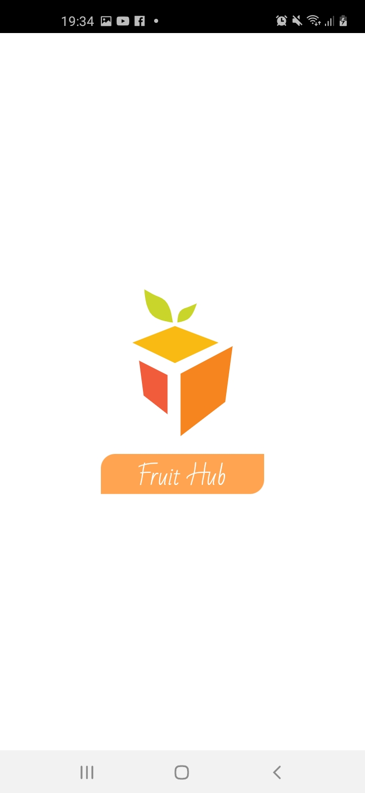
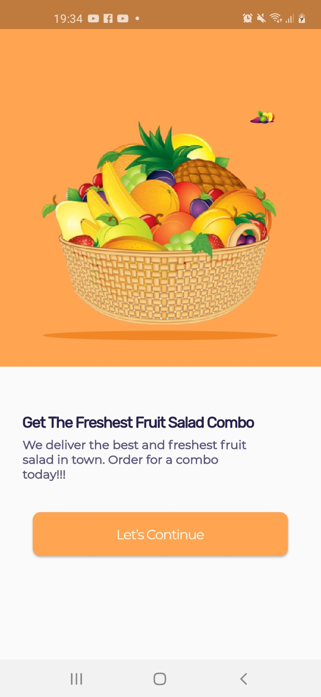
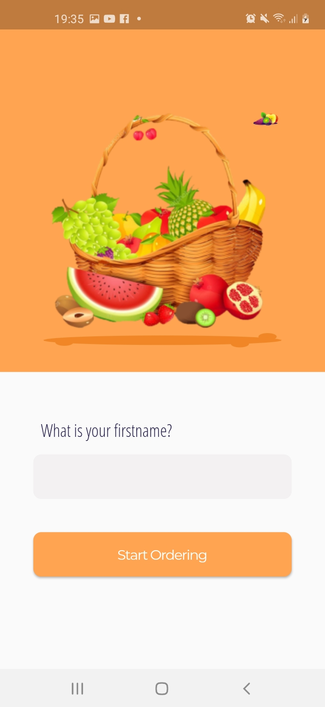
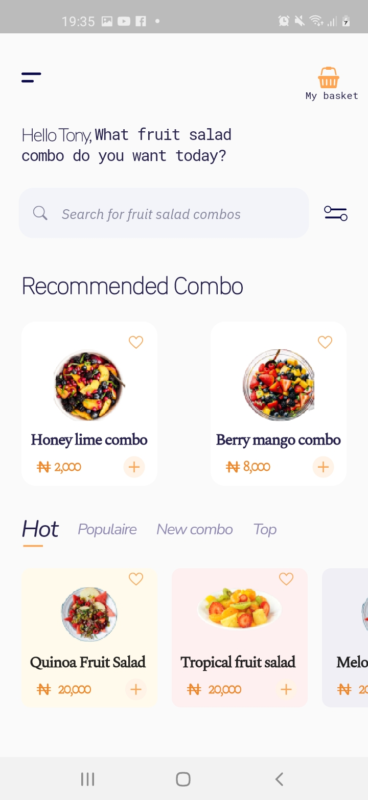
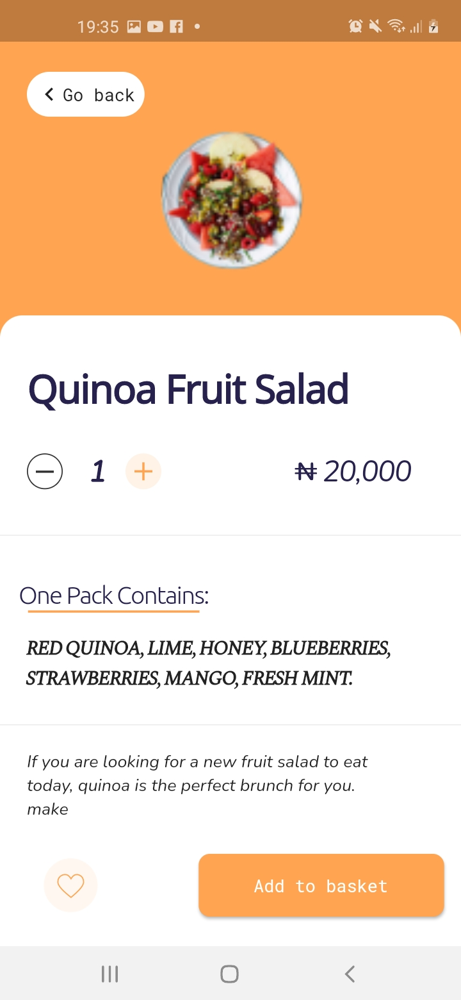
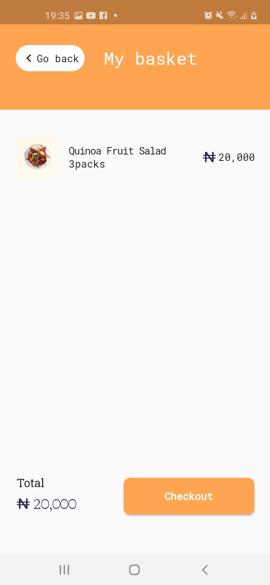
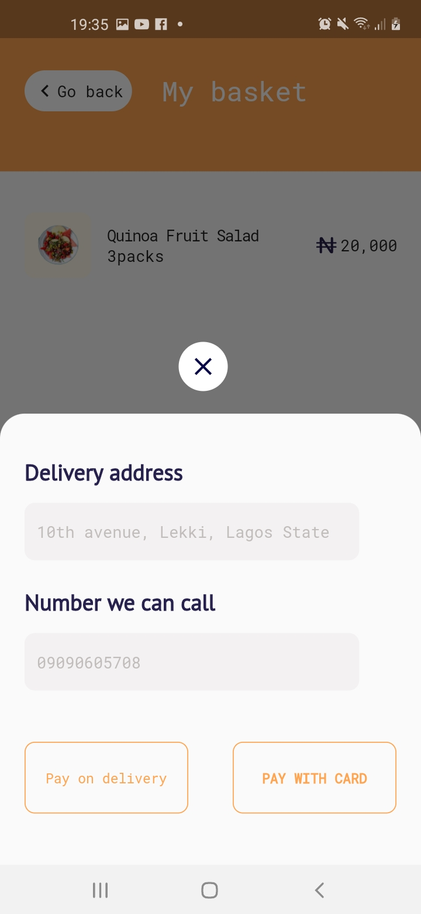
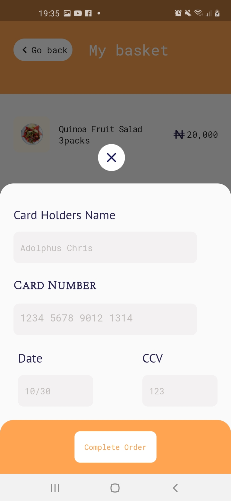
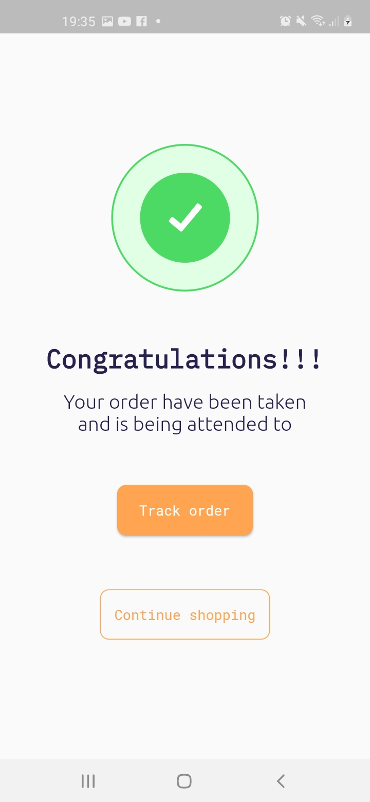

# Fruitzshop

Flutter representation of a Shop app UI i found in Figma.

**Star⭐ the repo if you like what you see😉.**

## 📸 ScreenShots

| 1 | 2 |
|-------|-------|
|||

| 3 | 4|
|------|------|
|||

| 5 | 6|
|------|------|
|||

| 7 | 8|
|------|------|
|||

| 9 | 10 |
|------|------|
||<h1 style="font-size:400">THANK YOU</h1>|
